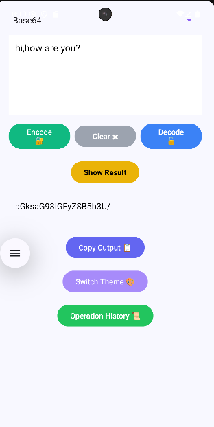
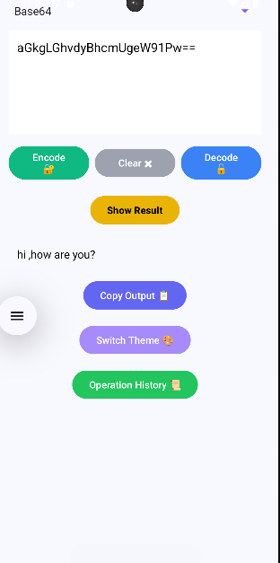
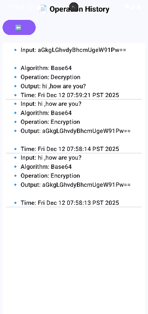

# Android Encryption App 🔐  
A multi-algorithm Android application for text **encryption** and **decryption**, featuring a clean UI, theme switching, and automatic history logging.

---

## 🚀 Features
- 🔒 **Encrypt & Decrypt text** using multiple algorithms:
  - Base64
  - Caesar Cipher
  - AES Encryption
  - Reverse Cipher
  - SHA-256 Hashing
  - Vigenère Cipher
- 🎨 **Theme Switching** (3 UI themes)
- 📜 **Operation History** with auto-clean each time the app starts
- 📋 Copy output with one click
- 🧼 Clear input button
- 📱 Smooth modern UI designed for ease of use

---

## 📸 Screenshots

### 🔐 Encryption Example


### 🔓 Decryption Example


### 📜 Operation History



---

## 🔧 Implemented Algorithms

### **1️⃣ Base64**
Encodes text into Base64 format and decodes it back.

```java
encoded = Base64.encodeToString(input.getBytes(), Base64.DEFAULT);
2️⃣ Caesar Cipher
Shifts each character by a fixed number (shift = 3).

java
Copy code
encoded = caesarEncrypt(input, 3);
3️⃣ AES Encryption
Uses standard AES algorithm to encrypt sensitive data.

java
Copy code
encoded = aesEncrypt(input);
4️⃣ Reverse Cipher
Simple but effective – reverses the entire string.

java
Copy code
encoded = reverseEncrypt(input);
5️⃣ SHA-256 Hashing
Generates a non-reversible hash output.

java
Copy code
encoded = sha256Hash(input);
6️⃣ Vigenère Cipher
Requires a key entered by the user.
If the key is empty, the app prevents the encryption from proceeding.

java
Copy code
String key = keyInput.getText().toString();
🧠 How It Works
Choose an algorithm from the spinner.

Enter your text.

Click Encode 🔐 or Decode 🔓.

Click Show Result to display output.

Copy or change theme with one tap.

View the entire history of operations.

History includes:

Input

Output

Chosen Algorithm

Operation Type (Encryption / Decryption)

Exact Timestamp

🎨 Themes
The app includes three switchable themes, each changing the full UI palette to enhance user experience.

📂 Project Structure
bash
Copy code
app/
 ├── java/
 │    ├── MainActivity.java
 │    ├── HistoryActivity.java
 │    └── algorithm functions...
 ├── res/
 │    ├── layout/
 │    ├── values/
 │    └── drawables/
 └── AndroidManifest.xml
🛠 Tech Stack
🎯 Java

🎯 Android Studio

🎯 Material UI Components

🎯 Secure cryptographic library (AES, Base64, SHA-256)

📌 Future Enhancements
Add QR code encryption/decryption

Export history as a file

Add biometric protection for the history page

👨‍💻 Author
Mohammad
Android Developer & Encryption Enthusiast

